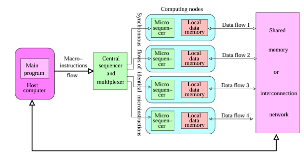

> Paralelní počítač je skupina **propojených výpočetních prvků (uzlů)**, které komunikují a spolupracují, aby rychleji vyřešily velké a výpočetné či paměťově náročné výpočetní úlohy.

## Hierarchie výpočetního paralelismu

1. **Vícevláknová jádra** 
    * Jedno vlákno provádí (střídavě) více vláken výpočtu současně
2. **Vícejádrové procesory**
    * Několik asynchronně pracujících jader uvnitř jednoho procesoru
3. **GPU akcelerátory**
    * Tisíce menších asynchronně pracujících jader
4. **Výpočetní SMP uzly**
    * Několik vícejádrových procesorů (s akcelerátory)
    * Mají mezi sebou buď **virtuálně** sdílenou paměť (pro programátora se tak tváří)
    * Nebo mohou tuto paměť sdílet i **fyzicky**
    * SMP = Symmetric Multiprocessors
5. **Výpočetní klastry**
    * Stovky až desetitisíce výpočetních SMP uzlů
6. **Masivně paralelní superpočítače**
    * Desetitisíce až staticíse výpočetních uzlů propojených speciálními rychlími sítěmi
    * Jedná se vlastně o velmi velký výpočetní klastr, který řeší spoustu dalších věcí, jako self-monitoring, propojení apod.
7. **Cloud computing** 
    * Datová centra

# Modely paralelních systémů
* Modely výpočetního stroje
    * HW, ISA, OS
    * Nebude ve zkoušce
* Modely architektury
    * Toky dat/instrukcí
    * Organizace paměti
    * Propojovací sítě
* Výpočetní modely
    * Analytický model pro návrh a verifikaci paralelních programů
    * Zástupci:
        * PRAM
        * BSP
        * APRAM
        * ...
* Programovací modely
    * Sémantika paralelních vyšších jazyků a prostředí
    * Model přístupu do sdílené paměti

## Model architektury
* Popisují, jak je řízen výpočet

### SIMD - Single Instruction Multiple Data
* Procesory synchronně provádějí tentýž kód, nad jinými daty
* Skládá se z:
    1. Pole identických výpočetních uzlů (Computing nodes). Každý uzel má mikrokontroler, 1 nebo více funkčních jednotek a lokální paměť. Na začátku výpočtu se do této paměti musí nahrát data.
    2. Uzly jsou kontrolovány jednou sekvencí **makroinstrukcí**, které dodává hostující počítač. Tyto instrukce jsou přeloženy do identické synchroní sekvence **mikroinstrukcí** a rozeslány **centrálním řaičem** všem uzlům. Celé je to typicky synchronizované globálními hodinami.
    3. Uzly komunikují předáváním dat do sdílené paměti, nebo skrze propojující síť
    4. V každém kroku může být uzel **aktivní** či **idle**. Toto se rozhoduje na bází **mask bitu**, který se vypočítává z adresy, nebo lokálního stavu uzlu. Je to důležité kvůli implementaci podmínek, větvení, výjimek apod., jelikož instrukce jsou pořád stejné. Když je tedy podmínka, každý uzel si vypočítá výsledek podmínky nad lokálními daty, nastaví mask bit a host poté rozešle postupně instrukce větve podmínky A a poté větve B.

    * Schéma:
        

* Dnes již nejsou SIMD počítače, téměř většina je MIMD, ale princip se pořád někde používá
    * Vektorová rozšíření procesorů 
        * Intel MMX/SSEx/AVX
        * AMD 3DNow!
        ...
    * GPU

## MIMD (Multiple Instructions Multiple Data)

* Každý uzel je samostatný počítač s instrukční a datovou pamětí
* Jednotlivé uzly běží asynchronně
* Patří sem vícejádrové procesory, SMP uzly, klastry a vícěméně úplně všechno až na akcelerátory
* Skládá se z:
    1. Propojených autonomních uzlů. Každý uzel má vlastní paměť a může provádět vlastní program.
    2. Není potřeba hostující počítač, ale typicky zde je.
    3. Individuální výpočty jsou prováděny asynchronně
    4. Komunikace mezi uzly je buď přes sdílenou paměť, nebo propojující síť 
    5. Existují zde synchronizační mechanismi mezi uzly, většinou implementované softwarem s HW podporou. Některé moderní MIMD používají speciální propojovací síť určenou čistě pro synchronizaci.
    * Schéma:
        

# Organizace paměti
## Sdílená paměť 
* Využíváno v SMP (Symmetric shared-memory MultiProcessors), UMA (Uniform Memory Access)
* Každý procesor může adresovat do jakékoliv paměťové buňky
* Všechny procesory vidí buňky společně a nemají žádnou privátní paměť
* Uzly komunikují přes sdílenou paměť - neexistuje jiný mechanismus, jako síť 
* Je dnes nejvíce používaná v komerčních serverech
* Je to jednoduché na naprogramování
* Škálování je omezené

## Distribuovaná paměť 
* NUMA - Non-Uniform Memory Access
* Každý procesor má svojí vlastní paměť
* Neexistuje žádná sdílená paměť
* Komunikace mezi uzly probíhá pomocí zpráv
    * Když potřebuje uzel číst nebo zapsat do paměti jiného uzlu, musí ho o to požádat
* Složitá na programování
* Dobře škáluje
* Je dnes nejvíce používaná v klastrech a masivních paralelních multiprocesorech

## Virtuálně sdílená paměť 
* CC-NUMA (Cache Coherent NUMA )
* Tváří se jako sdílená paměť, ale je distribuovaná.
* Máme tam správce paměti (softwarová vrstva), který rozpozná, že data jsou na jiném uzlu a pokud ano, tak vyšle zprávu jinému uzlu jako u distribuované
* Pro programátora se to však tváří jako sdílená paměť 

# Propojovací sítě paralelní architektury
## Systémy se sdílenou pamětí
* Multiprocesorová sběrnice
    * Vhodná pro menší počty uzlů 
    * S rostouím počtem uzlů klesá výkonnost

* Křížový přepínač
    * Velmi výkonný
    * Složitý a zhoršuje se to s kvadrátem počtu uzlů

* Vícestupňová nepřímá propojovací síť
    * Jinak také MIN - Multistage Interconnection Network
    * Do jisté míry zjednodušuje složitost křížového přepínače 

## Systémy s distribuovanou pamětí
* Křížový přepínač
* Vícestupňová nepřímá propojovací síť
* Přímá propojovací síť
    * Uzly jsou vrcholy souvislého grafu
* Hierarchická propojovací síť
    * Využívá hierarchie prstenců, nebo přepínačů
    * Využívaná ve většině vícejádrových procesorů (např. Xeon)

# Výpočetní model: Paralelní RAM (PRAM)
* Nejjednodušší, nejméně realistický
* Parallel Random Access Machine

## Princip fungování
* Skládá se z množiny $p$ procesorů RAM $P_1, P_2,..., P_p$
* Každý $P_i$ má vlastní **lokální paměť** a zná svůj index $i$
* Dále máme pole $m$ **sdílených** paměťových buňek $M[1], M[2], ... , M[m]$ a každý procesor $P_i$ může vstoupit do jakékoliv buňky v $O(1)$ čase
* Řešení konfliktů při přístupu musí být ošetřeno **explicitně**
    * Více níže
* Všechny procesory **musí běžet synchronně** a provádějí vždy stejný typ instrukcí
    * Čtení buňky sdílené paměti (krátce **R**)
    * Lokální operace (krátce **L**)
    * Zápis do buňky sdílené paměti (krátce **W**)
* Jediný způsob komunikace mezi procesory je zápis do sdílené paměti

* Procesor $P_1$ má speciální roli - iniciuje a terminuje výpočet. Dále si v registr $R_A$ udržuje pole 1 a 0 pro každý $P_i$, čímž rozhoduje zdali je procesor $P_i$ aktivní, či idle (vlastně je to mask bit)

## Výpočet / algoritmus
* Na vstupu máme dvě čísla $p$ = počet aktivních procesorů a $n$ = počet buněk sdílené paměti potřebných pro výpočet. To zahrnuje i buňky pro vstupy, výstup a pomocná data
* Provedení je poté následující
    * $P_1$ načte $R_A$ a pošle signály spuštění do $P_2,...,P_p$
    * Výpočet se zastaví, jestliže jsou všechny procesory $P_2,...P_p$ zastaveny a zastaví se také $P_1$ 
* Časová složitost PRAM algoritmu je doba od počátku běhu do zastavení. Počítá se podle dvou různých modelů:
    * **Jednotkový model** - každá operace R/L/W trvá čas 1
    * **Globální model** - L trvá čas 1 a R/W trvají konstantní čas $d > 1$
* Algoritmus se dá také napsat jako regulární výraz výše zmíněných typů instrukcí

## Ošetření konfliktů přístupu do sdílené paměti
* Exclusive Read Exclusive Write (EREW)
    * Žádné 2 procesory nesmí číst ani zapisovat tutéž paměťovou buňku
* Concurrent Read Exclusive Write (CREW)
    * Současné čtení je dovolené
    * Ale pouze jeden procesor může zapisovat
* Concurrent Read Concurrent Write (CRCR)
    * Dovolený současná čtení i současné zápisy téže sdílené buňky
    * Následující možnosti:
        * Priority
            * Dokončení zápisu je povoleno procesoru s nejvyšší prioritou
        * Arbitrary
            * Dokončení zápisu je povoleno **náhodnému** procesoru
        * Common
            * Je povoleno všem procesorům právě tehdy, pokud zapisují stejnou hodnotu.

# Výpočetní model: Asynchronní PRAM
* Procesory pracují asynchronně, neexistují globální hodiny
* Je ale nutná explicitní synchronizace - pomocí bariér
* Doba přístupu do sdílené paměti **není jednotková**
* Výpočet je vlastně posloupnost **globálních fází**, ve kterých procesory pracují asynchronně. Fáze jsou odděleni bariérami
* Dva procesory (či více) nemohou přistupovat do téže buňky sdílené paměti v téže globální fázi, pokud jeden z nich do ní zapisuje

## Výkonnostní parametry
* Lokální operace = 1
* Globální R/W = $d$
* k po sobě jdoucích operací R/W = $d + k-1$
    * Optimalizace paměťovým pipeliningem
* Bariérová synchronizace = $B(p)$
    * Různé implementace bariéry (např. čítač)

### Různé implementace bariéry
* Centrální čítač, inicializovaný na 0, $B(p) = \Theta(dp)$
    1. Proces dorazí k bariéře, zkontroluje, zda je v příchozí fázi a inkrementuje čítač
    2. Je-li čítač $<p$, proces se deaktivuje
    3. Jinak nastaví bariéru do odchozí fáze a aktivuje ostatní procesy
    4. Poslední aktivovaný proces nastaví bariéru do příchozí fáze
* Binární redukční strom, $B(p) = \Theta(d*\log p)$
    1. Proces dorazí k bariéře a zkontroluje, zda je v příchozí fázi
    2. Čeká na skončení redukce v jeho podstromu
    3. Po skončení redukce odešle signál jeho rodiči
    4. Kořen stromu čeká na redukci z obou podstromů a poté přepne bariéru do odchozí fáze
    5. Procesy se aktivují ve zpětném pořadí

# Programovací model: Typy paralelních konstrukcí

## Instrukční paralelismus
* nezabýváme se tím - je to na úrovní HW

## Datový paralelismus 
* Prvky datové struktury jsou rovnoměrně rozděleny mezi procesory, z nichž každý provádí **synchronně** výpočet nad přidělenou částí
* Nejčastější paralelní datovou strukturou je **paralelní pole** 
* Jednotlivé iterace cyklu jsou prováděny současně samostatnými procesory a nemusí být zaručeno pořadí - musí být zaručena datová nezávislost
	* Překladačem - implicitní paralelismus
	* Programátorem - explicitní paralelismus
* Původně byl velmi významným jazykem **HPF - High Performance Fortran**
	* Dnes už se od toho odstupuje a převažuje univerzálnější způsob [[#Single Program Multiple Data (SPMD)|SPMD]]
* Instrukčním pohledem na datový paralelismus je vlastně iterační paralelismus. V přednášce se tyhle pojmy už sloučili

## Funkční paralelismus
* Jiný název je task paralelismus
* Program je rozdělen do nezávislých kusů kódu, zvaných **úlohy**, které mohou být prováděny paralelně
* Úlohy tvoří graf, který definuje jejich datové závislosti, což implikuje jejich plánování
* Tyto úlohy mohou být strukturované bloky, funkce, rekurzivní volání atp.
* Úlohy mohou být jak sekvenční, tak paralelizovatelné 
* Plánování je často založeno na zásobárně úloh

# Programovací model: Paralelní programovací šablony

## Pipelining
* Vlákna se podílí na postupném zpracování

## Fork-join / Parbegin-Parend / Cobegin-Coend
* Výpočet začíná sekvenčně, poté se znovu spojí a takto se to opakuje
* Počet paralelních vláken se může v průběhu měnit

## Single Program Multiple Data (SPMD)
* Nejběžnější programovací vzor (OpenMP, MPI)
* Všechna vlákna provádějí asynchronně tentýž statický kód
* Synchronizace musí být zajištěna **explicitně**, pomocí synchronizačních operací
* Unikátní identifikátory vláken v kódu zajišťují rozlišení výpočtů

## Master-Slave 
* Master přiděluje práci, slave pracují a vracejí výsledky

## Client-Server
* Klienti požadují práci, server jí přiděluje

## Producent-Konzument
* Producentská vlákna dodávají úlohy do **zásobárny úloh** pro konzumentská vlákna, která je provádějí